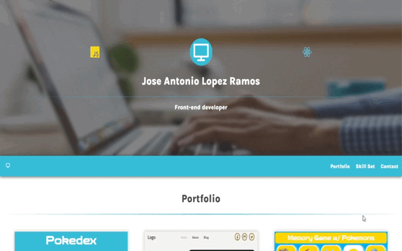

# A clean and responsive portfolio for my projects

<h2 align="center">
    
 

</h2>

<h2>Features:</h2>

<ul>
    <li>One Page Layout built with React</li>
    <li>Fully Responsive</li>
    <li>Minimalist</li>
    <li>Pure vanilla CSS</li>
<ul>

<h2>Technologies used:</h2>

<ul>
    <li>React</li>
    <li>CSS</li>
    <li>HTML</li>
    <li>React-Icons</li>
<ul>

<h2>See live demo, <a target="_blank" href="https://joseantoniolopezramos.site/">Click here</a>.</h2>

